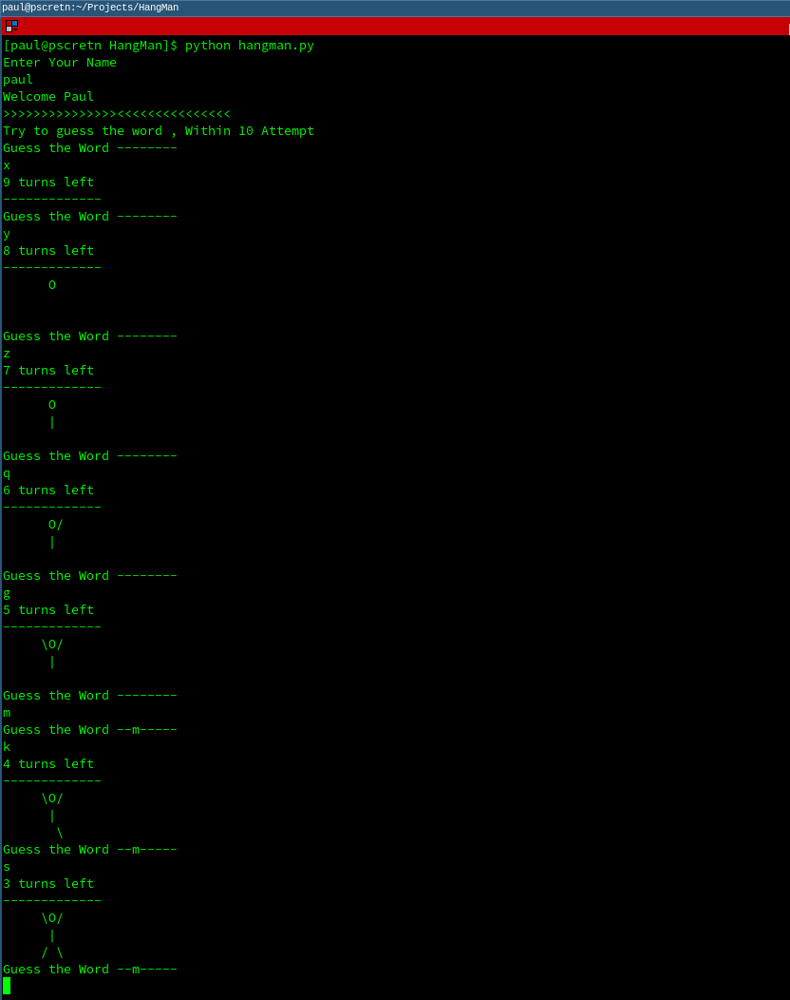
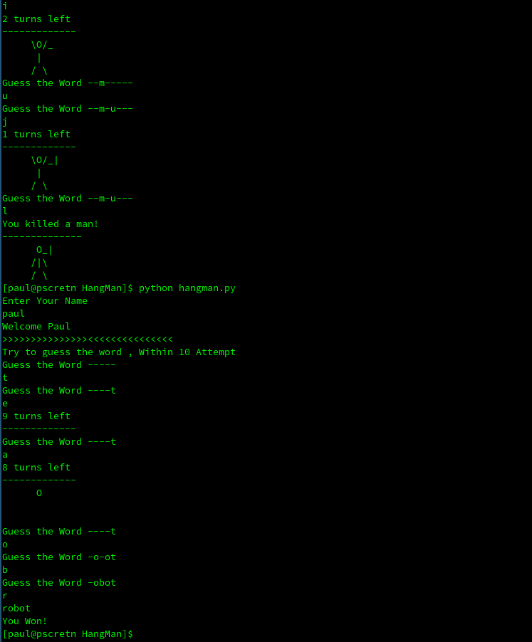

# Hangman-Using-Python
Hangman is non gui word guessing game written in python. It will run on terminals and ide's
<br><br><br>
To get started with Hangman we need to import library called ```random``` which is used to get random values as shown below
```python
import random
```
# Program
```python
import random #inorder to work random functions we need to import 'random' library at first

def hangman(): # here we define a functions called 'hangman()' , we use function whenever required
    
    word = random.choice(["computer","earth","water","aeroplane","satellite","robot","helicopter"]) # 'random.choice' is used select a random value from a list , words in the list can be changed if required
    validletter = 'abcdefghijklmnopqrstuvwxyz' 
    turns = 10
    guessmade = ''
    
    while(len(word) > 0 ): # here we check conditon if length of word is greater than zero  the while loop will be executed 
        mainword = ""
        for letter in word:
            if letter in guessmade:
                mainword = mainword + letter
            else:
                mainword = mainword + "-" + ""
        if mainword == word:
            print(mainword)
            print("You Won!")
            break

        print("Guess the Word" , mainword)
        guess = input()

        if guess in validletter:
            guessmade = guessmade + guess
        
        else:
            print("Enter a Letter")
            
      
        if guess not in word:
            turns = turns - 1
            if turns == 9:
                print("9 turns left")
                print("-------------")
            
            if turns == 8:
                print("8 turns left")
                print("-------------")
                print("      O      ")
                print("             ")
                print("             ")
 
            if turns == 7:
                print("7 turns left")
                print("-------------")
                print("      O      ")
                print("      |      ")
                print("             ")

            if turns == 6:
                print("6 turns left")
                print("-------------")
                print("      O/     ")
                print("      |      ")
                print("             ")

            if turns == 5:
                print("5 turns left")
                print("-------------")
                print("     \O/     ")
                print("      |      ")
                print("             ")    

            if turns == 4:
                print("4 turns left")
                print("-------------")
                print("     \O/     ")
                print("      |      ")
                print("       \     ")

            if turns == 3:
                print("3 turns left")
                print("-------------")
                print("     \O/     ")
                print("      |      ")
                print("     / \     ")

            if turns == 2:
                print("2 turns left")
                print("-------------")
                print("     \O/_    ")
                print("      |      ")
                print("     / \     ")

            if turns == 1:
                print("1 turns left")
                print("-------------")
                print("     \O/_|   ")
                print("      |      ")
                print("     / \     ")
                    
            if turns == 0:
                print("You killed a man!")
                print("--------------")
                print("      O_|     ")
                print("     /|\      ")
                print("     / \      ")
                break


            
name =input("Enter Your Name\n") #input from the user
print("Welcome",name.title())
print(">>>>>>>>>>>>>>><<<<<<<<<<<<<<<")
print("Try to guess the word , Within 10 Attempt")
hangman() # here we call the function 'hangman()'
```
# Output
The Shown below images is the screenshot of program runned in linux terminal 
<br><br>


